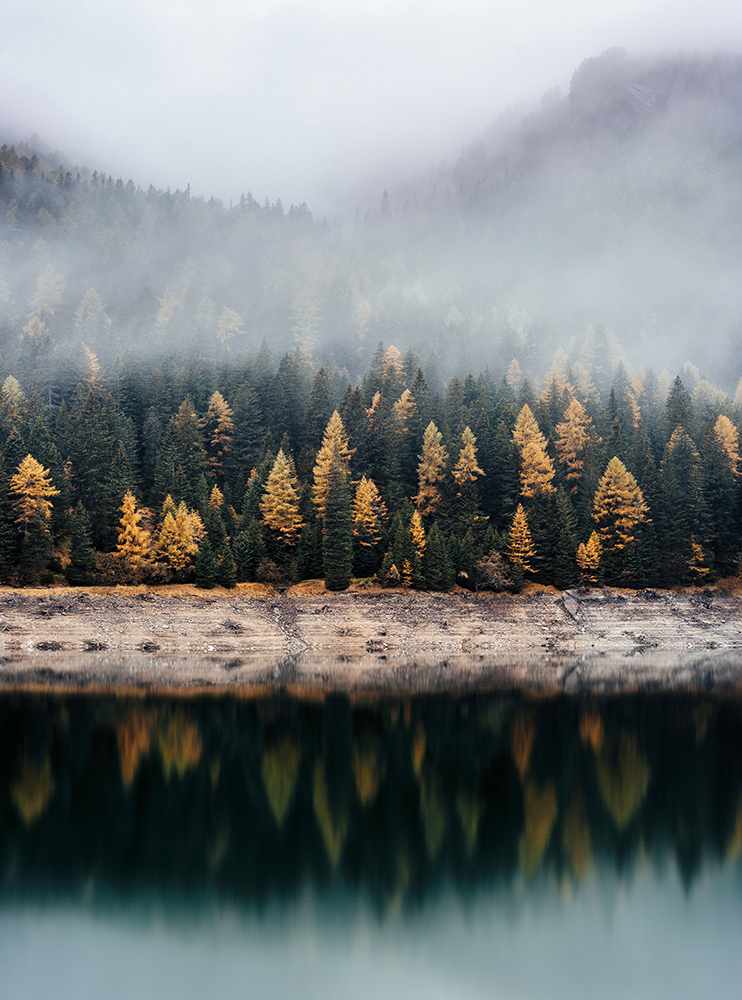
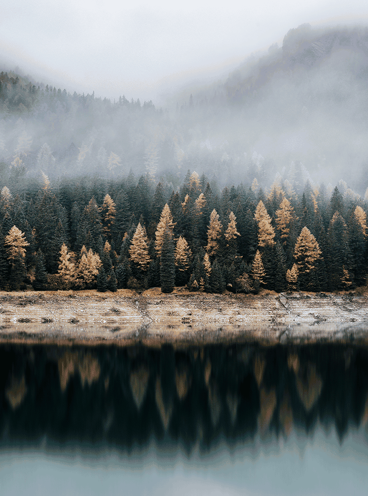
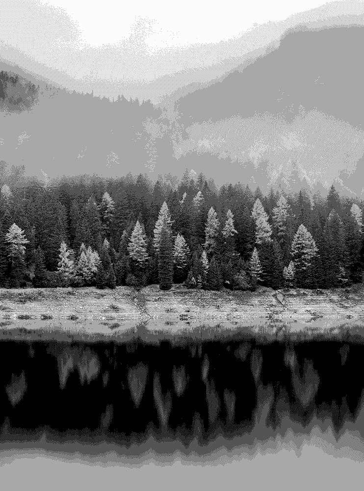

# Image Converter (.bmp :left_right_arrow: .karol)

In this project we've developed a converter that converts .bmp to .karol and then do the same, yet in the opposite direction. By default, **Byte Run** is performed. The conversion is accompanied by additional operations. First one is converting to **Grayscale**, to **Imposed Color Palette** or to **Color Palette chosen by Median Cut** algorithm. Those last two choices yield in return an image that has **64-color palette**. After that, user is prompted to decide whether to use **Floyd-Steinberg (a.k.a dithering) algorithm** or not. Last option consists of choices for what to do with the output - save it as .bmp, .karol or not to save it at all.

___

<strong>Preview</strong>

| Original Image  | Median Cut (includes Dithering) | Grayscale (includes Dithering) |
|  :---:  |  :---:  |  :---: |
|  |  |  |

___

## Launching the Converter

In order to launch the converter make sure you have properly intialised SDL with Visual Studio 2017. 
**[Seting Up SDL with Visual Studio 2017](https://www.wikihow.com/Set-Up-SDL-with-Visual-Studio-2017)**

## To-Do List:
- [x] ~~Open and save .bmp file~~
- [x] ~~Find closest color in Imposed Palette~~
- [x] ~~Median Cut algorithm~~
- [x] ~~Perform Grayscale conversion~~
- [x] ~~Floyd-Steinberg algorithm~~
- [ ] Open and save .karol file properly
- [ ] Fix Byte Run to run properly with any given input

## Authors

* [Kamil Nowak](https://github.com/nowakkamil)
* [Grzegorz Piwosz](https://github.com/LaYatiX)
* [Karol Piaśnik](https://github.com/KarolPiasnik)
